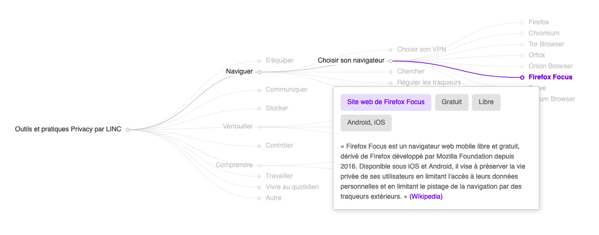

# Carto Privacy v2.0 by LINC

[EN COURS] Le [Laboratoire d'Innovation Numérique de la CNIL (LINC)](https://linc.cnil.fr) publie la version 2.0 de sa [cartographie des outils et pratiques](#) respectueuses de la vie privée sous licence Creative Commons CC-BY.

## Sommaire
- [Carto Privacy v2.0 by LINC](#carto-privacy-v20-by-linc)
- [La cartographie](#la-cartographie)
- [Développement](#développement)
- [Contribuer](#contribuer)
    - [Modifier la base de donnée](#modifier-la-base-de-donnée)
    - [Participer à la discussion](#participer-à-la-discussion)
- [Contenu du dossier](#contenu-du-dossier)
- [Licence](#Licence)
- [Auteurs et autrices](#auteurs-et-autrices)
- [Sources ?](#sources)

## La cartographie
Le LINC a choisi de symboliser des usages par des verbes, découpés en actions et des sous-actions. Pour chacune des sous-actions, le LINC a repéré certaines caractéristiques et fonctionnalités spécifiques, protectrices de la vie privée (décrites dans les bulles infos). A titre d'exemple, la cartographie recense des services qui annoncent mettre en œuvre une ou plusieurs des caractéristiques présentées. Chacun de ces services est présenté par un court texte de description, tiré selon les cas du site du service ou de sa fiche Wikipedia.

⚠️ Cette cartographie n'a pas vocation à être exhaustive, les différents services cités ne font l'objet d'aucune labellisation par la CNIL, ils reflètent au mieux un état des lieux transitoire des propositions repérées par le LINC. ⚠️

## Développement

La cartographie s'appuie sur une base de donnée au format csv, convertie ensuite en JSON avec la librairie D3.js puis mise en forme avec la librairie Apache Echarts. Ce format permet de la rendre collaborative : que vous soyez développeur·euse ou utilisateur·ice de services numériques, la cartographie a vocation à être enrichie, améliorée mais aussi copiée tant dans sa forme que dans son contenu. Les différentes manières de contribuer son listées dans la section [Contribuer](#contribuer) et les possibles objectifs de développement dans la [Roadmap](roadmap.md).
Cette cartographie se veut être une des interface visuelle possible de la base de donnée csv, mais d'autres peuvent être conçues ou développées.

## Contribuer
La [Roadmap](roadmap.md) vous aidera à cerner les besoins en terme de contributions.

### Modifier le contenu
Ajouter ou en modifier une pratique ou un service dans [la base de donnée csv](data.csv) est simple et peut se faire directement sur la page GitHub de [data.csv](data.csv) (en cliquant sur l'icône de crayon à droite). Veillez à bien respecter le même format que le reste des données du fichier ainsi qu'à faire attention aux majuscules, accents et espaces.

Petit guide pour le contenu :
- parent : permet de déterminer la hierarchie de la cartographie. Ne peut pas être laissé vide.
- nom : le nom de la pratique ou de l'outil. Ne peut être laissé vide
- lien : lien vers le site de l'outil (préférer un site web officiel recensant toutes les installations possibles plutôt que la page Google Play par exemple).
- type : `outil`, `pratique` ou `titre`.
- description : Courte explication tirée de Wikipedia, du site web de l'outil dans le cas échéant. Il peut aussi d'agir du site de la CNIL pour les pratiques.
- prix : `Payant`, `Freemium` ou `Gratuit`.
- license : `Propriétaire` ou `Libre`.
- plateformes : dans l'ordre : `GNU/Linux`, `Windows`, `macOS`, `Android`, `iOS`, `iPadOS`, `Navigateur`.

### Modifier le code
Toute participation est la bienvenue concernant l'amélioration de parties du code gérant la cartoraphie.

### Participer à la discussion
Il est possible d'écrire des commentaires ou suggestions via l'onglet "Issue" afin de discuter d'une solution de la cartographie, d'une éventuelle adition ou des raisons d'une absence.

### Réutiliser la cartographie
Réalisez une fork du projet ou proposez des pull requests.

## Contenu du dossier
Sous dossiers
- [images](images) contient les images necessaires à la documentation GitHub.
- [tests](tests) contient des bouts de code ou des essais divers.

Fichiers
- [README.md](README.md) le fichier que vous lisez actuellement.
- [note.md](note.md) des indications pour le développement de la cartographie.
- [data.csv](data.csv) les données de la cartographie, c'est à dire tous les outils et pratiques listées, les titres mais aussi la hierarchie de ces éléments et leurs infos. 
- [tree.js](tree.js) le fichier javascript permettant de générer la cartographie depuis la base de donnée data.csv. Gère aussi l'aspect stylistique de la cartographie.
- [index.html](index.html) la page web contenant la cartographie.
- [main.css](main.css) la feuille de style de index.html.
- [echarts.js](echarts.js) la librairie qui permet de générer la cartographie.
- [LICENSE](LICENSE) la license GPLv3 du projet.
- [.gitignore](.gitignore) permet de spécifier les fichiers ignorés par git.

## License

Le projet est sous license.............

## Auteurs et autrices

Agents et agentes de la CNIL pendant l'Open LINC
.......................................

## Sources

.......................................

[Retour en haut](#carto-privacy-v20-by-linc)