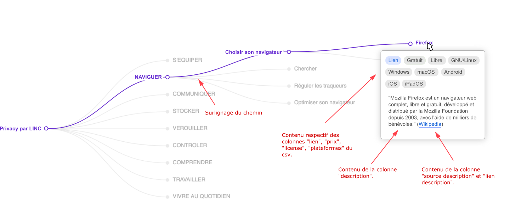

## Présentation
Comme d3.js devenait un peu dur à gerer pour implémenter ce que je voulais, je suis parti sur [echarts.js](https://echarts.apache.org/) pour faire mon arbre. L'arbre est rétractable, s'adapte à la taille du conteneur quand on resize la page, la page html est scrollable, un tooltip est déjà implémenté, il y a un effet d'emphase au hover...

Je suis donc parti de leur exemple [Tree with Polyline Edge](https://echarts.apache.org/examples/en/index.html#chart-type-tree). Mais n'étant pas le plus à l'aise avec Javascript et malgré mes recherches j'ai parfois du mal à faire ce que je veux.

## Rendu visuel
Voici une image montrant à quoi pourra ressembler la cartographie. Le design n'est pas définitif dans les formes et les couleurs mais permet de montrer comment le contenu du csv est intégré à la cartographie (notamment dans le tooltip). L'important étant que les différents éléments soient bien lisibles.

## ~~Parser data.csv pour l'utiliser~~ [RESOLU, voir tests/csv-parse.js]
~~Actuellement la carto contient les données de l'exemple et je n'ai pas réussi à mettre le fichier csv dans le même format. J'ai essayé avec d3 et papaparse (même si je pense que papaparse ne permet pas d'obtenir une hierarchie ?).~~
~~Il ne s'agit pas simplement de parser le fichier de csv vers json, il faut garder la hierarchie inscrite dans le fichier csv (la colonne "parent").~~
- ~~["Stratify" de d3](https://github.com/d3/d3-hierarchy#stratify)~~
- ~~[Explication de "Stratify" de d3](https://observablehq.com/@d3/d3-stratify)~~
- ~~[Mon test (sans succès) avec "Stratify"](tests/test-d3stratify.js)~~
- ~~[Papaparse](https://www.papaparse.com/)~~

## Faire réapparaitre la carto
Depuis que j'ai touché au css de [main.css](main.css), la carto ne s'affiche plus. Peut-être une histoire de `canvas` ou de taille de la div contenant la carto ?

## Inclure le code pour parser dans tree.js
J'ai essayé mais je n'ai pas réussi à inclure le code de [tests/csv-parse.js](tests/csv-parse.js) dans le fichier tree.js. J'ai créé un fichier de test pour ça : [tests/tree-test.js](tests/tree-test.js).

### Changer les infos affichées dans le tooltip
Les infos affichées dans le tooltip dependent de chaque type de graphique proposé par echarts. Pour les graphiques en arbre il affiche le chemin ainsi que qu'une valeur "value" (qui est dans les données de l'exemple). Moi j'aimerais pouvoir afficher différentes informations, comme montré dans [l'image plus haut](#rendu-visuel). Toutes les infos necessaires sont bien dans le JSON obtenu depuis le csv.
- [Documentation tree -> tooltip](https://echarts.apache.org/en/option.html#series-tree.tooltip)
- [Formatting of Values in Tooltip](https://echarts.apache.org/handbook/en/basics/release-note/5-3-0/#formatting-of-values-in-tooltip)

## Localisation de la librairie Echarts
Actuellement la librairie Echarts se trouve dans le fichier Echarts.js, alors que d3 est appelée via un lien ? Qu'est ce qui est le mieux dans ce genre de projet qu'on ordonne tout ça ?